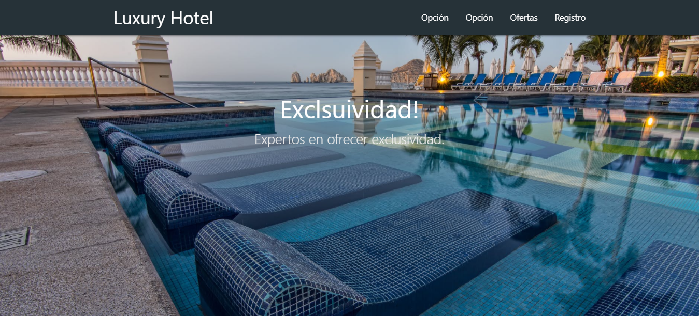
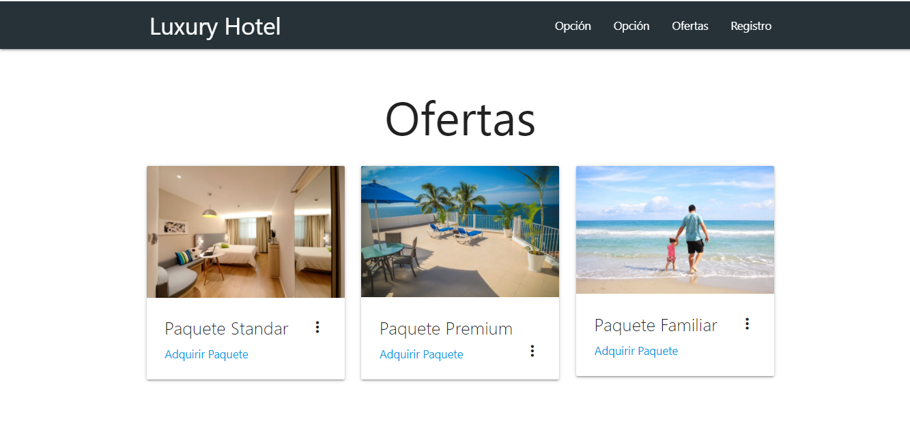
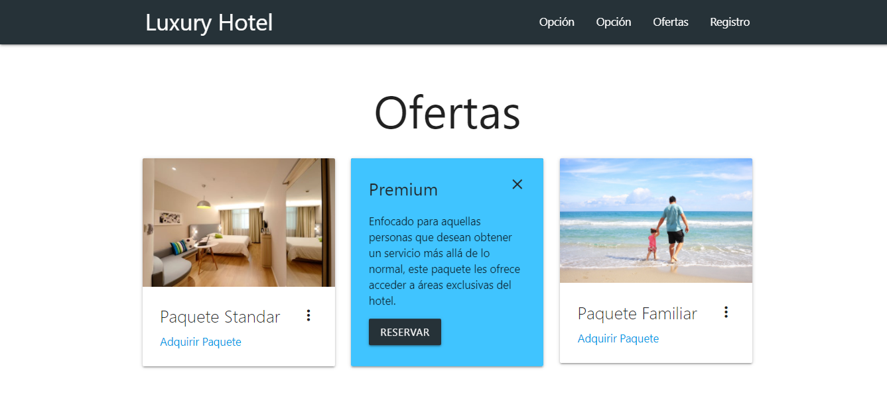
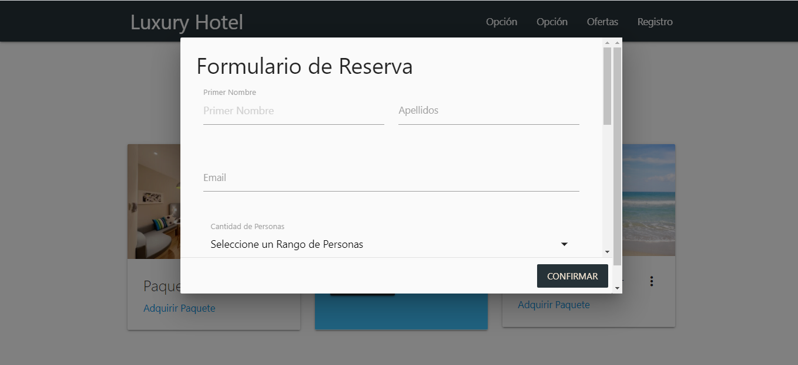
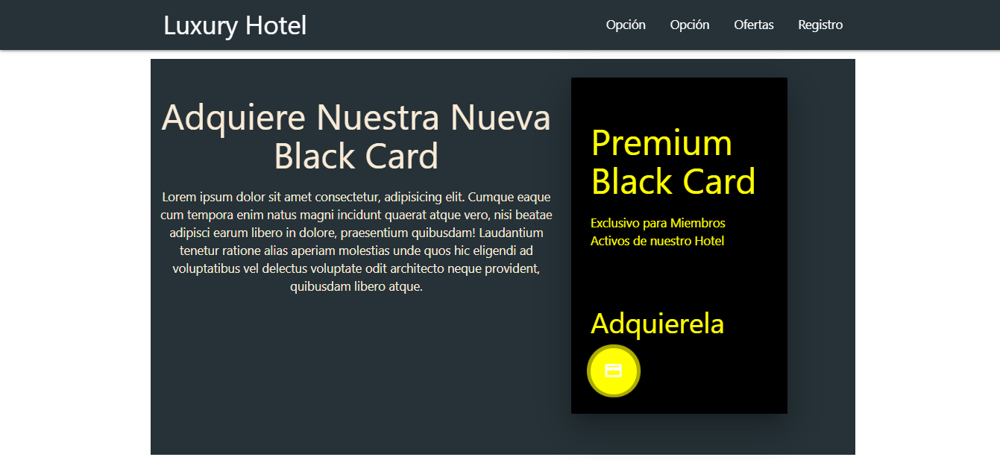
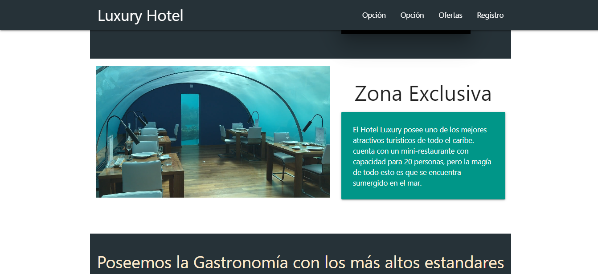
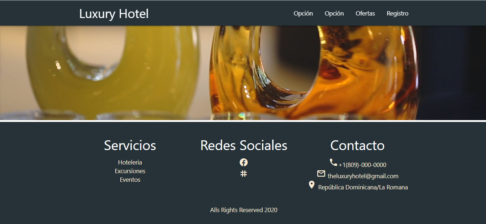

# Página Web Hotel

Es un proyecto sencillo basado en una página web de un hotel en donde se ofrecen diferentes
servicios, nos ofrece una área para poder reservar de manera básica ya sea una habitación, una estadía familiar, etc.
Nos ofrece varios apartado en donde nos da información acerca de cual es la función de hotel, cuales son los servicios
que ofrecen, y las partes exclusivas con lo que cuenta el hotel.

## Tecnologías Utilizadas

- HTML5

- CSS

- JavaScript

- Materialize CSS/Sass

